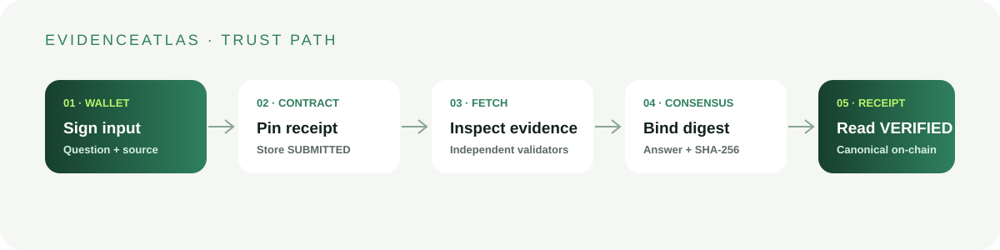
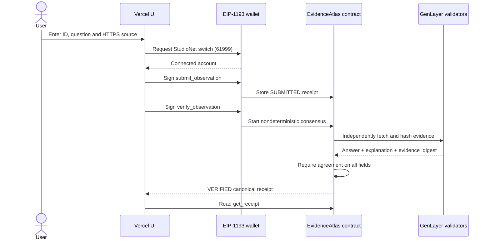

# EvidenceAtlas

> Durable observation receipts, bound to independently fetched evidence.

[](https://explorer-studio.genlayer.com/address/0x35187fC98E72e2236B3E2874050Bb577C51F54b5) [](https://evidence-atlas-bice-two.vercel.app) [](LICENSE)

EvidenceAtlas turns a public question and an HTTPS source into a durable, auditable receipt. The browser signs real transactions; the Intelligent Contract stores the request, validators independently fetch the evidence, and consensus finalizes an answer plus the exact SHA-256 digest of the fetched text.

## Live release

| Resource | Link |
| --- | --- |
| Production UI | [evidence-atlas-bice-two.vercel.app](https://evidence-atlas-bice-two.vercel.app) |
| StudioNet contract | [`0x35187fC98E72e2236B3E2874050Bb577C51F54b5`](https://explorer-studio.genlayer.com/address/0x35187fC98E72e2236B3E2874050Bb577C51F54b5) |
| Deployment transaction | [`0x80b66de1…5994f6a`](https://explorer-studio.genlayer.com/tx/0x80b66de1865993d0bef0a67dc6af8c69059df8550e089f12af2cce6065994f6a) |
| Network | GenLayer StudioNet · chain ID `61999` (`0xf22f`) |

## Product workflow





### Trust properties

1. Input pinning validates receipt IDs, questions and HTTPS URLs before storage.
2. A receipt moves from `SUBMITTED` to `VERIFIED` only once.
3. Validators fetch the public source independently through `gl.nondet.web.render`.
4. Consensus binds the answer, explanation and SHA-256 evidence digest.
5. The UI reports success only after reading canonical `get_receipt` state.

## Contract API

| Method | Type | Purpose |
| --- | --- | --- |
| `submit_observation(receipt_id, question, evidence_url)` | write | Store a new `SUBMITTED` receipt. |
| `verify_observation(receipt_id)` | write | Fetch evidence and finalize consensus. |
| `get_receipt(receipt_id)` | view | Return canonical JSON receipt. |
| `list_receipt_ids()` | view | List stored identifiers. |
| `get_schema()` | view | Return answers and protocol limits. |

## Run locally

### Prerequisites

Python 3.11+, the GenLayer CLI (`pip install -r requirements.txt`), Node.js 20+, npm, and an EIP-1193 wallet funded on StudioNet for writes.

### Validate contract and frontend

```bash
python -m py_compile contracts/evidence_atlas.py
python -m pytest -q
genvm-lint check contracts/evidence_atlas.py
cd frontend
npm ci
npm run build
```

### Start the app

```bash
cd frontend
cp .env.example .env.local
npm run dev
```

The default configuration uses the verified release:

```env
VITE_CONTRACT_ADDRESS=0x35187fC98E72e2236B3E2874050Bb577C51F54b5
VITE_RPC_URL=https://studio.genlayer.com/api
```

### Exercise the complete flow

1. Click **Connect wallet** and approve the automatic switch/add-network request for StudioNet (`61999`).
2. Enter `EVENT-001`, a 20–1000 character question, and an HTTPS source.
3. Click **Submit observation** and approve the wallet transaction.
4. Click **Run consensus** and wait for GenLayer finality.
5. Confirm the receipt panel reads finalized JSON from `get_receipt`.
6. A second verification attempt must fail because the receipt is already `VERIFIED`.

The submit action also blocks empty/invalid arguments in the browser before signing. If the wallet is on another network (for example chain `5042`), the app requests a switch to StudioNet before sending the transaction.

The top navigation is functional: **Workspace** focuses the compose form, **Protocol** jumps to the protocol metrics, and **Activity** jumps to the canonical receipt/lifecycle panel. Each destination updates the URL hash for shareable deep links.

## Deployment

Keep the address, transaction, environment, evidence packet and README synchronized in one commit:

```bash
genlayer deploy --contract contracts/evidence_atlas.py --rpc https://studio.genlayer.com/api
cd frontend
vercel link --project evidence-atlas-bice --yes
vercel env add VITE_CONTRACT_ADDRESS production --force --yes
vercel deploy --prod --yes
```

## Repository map

```text
contracts/evidence_atlas.py    Intelligent Contract and consensus rules
frontend/src/main.tsx          Wallet connection, writes, reads and UI
frontend/src/*.css             Product UI, motion and responsive styles
deployments/studionet.json     Verified release metadata
docs/ARCHITECTURE.md           Design and trust boundaries
docs/EVIDENCE_PACKET.md        Reproducible reviewer flow
docs/THREAT_MODEL.md           Threats and mitigations
```

## Verification record

- `python -m pytest -q` → 3 passed.
- `python -m py_compile contracts/evidence_atlas.py` → passed.
- `npm run build` → passed; Vite reports only a bundle-size advisory.
- Production HTTP check → `200`.
- On-chain `get_schema` against `0x35187f…54b5` → successful.

See [architecture](docs/ARCHITECTURE.md), [evidence packet](docs/EVIDENCE_PACKET.md), [threat model](docs/THREAT_MODEL.md), [source provenance](SOURCE_PROVENANCE.md), and [verification status](VERIFICATION_STATUS.md).

EvidenceAtlas is an evidence-indexing demonstration, not professional advice.
