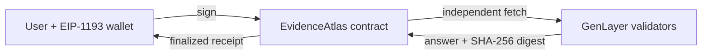

# EvidenceAtlas

> A wallet-driven GenLayer Project for durable, evidence-bound observation receipts.

[](https://genlayer-explorer.vercel.app/address/0x39E82ec39C548Eed0b6dF9E226f5767400272c52) [](https://evidence-atlas-bice.vercel.app) [](LICENSE)

## Project

EvidenceAtlas is a small GenLayer Project for creating durable, verifiable observation receipts. A user submits a question and HTTPS evidence URL, signs the transaction, waits for validator finality, and reads the canonical receipt back from the contract.

## At a glance

| Layer | Responsibility |
| --- | --- |
| Browser | Wallet connection, signed writes, receipt polling, canonical readback |
| Intelligent Contract | Request storage, independent evidence retrieval, typed consensus result |
| Validators | Re-fetch evidence and agree on answer, explanation and evidence digest |



### User workflow

1. Connect a wallet to the configured GenLayer network.
2. Submit an observation question and source URL through the app.
3. The contract stores the request before any semantic decision.
4. `verify_observation` independently fetches the source and asks validators to classify it.
5. Consensus binds the answer to the exact evidence digest.
6. The UI reads `get_receipt` and shows the durable result; a transaction hash alone is never treated as success.

### Contract surface

- `submit_observation(receipt_id, question, evidence_url)`
- `verify_observation(receipt_id)`
- `get_receipt(receipt_id)`
- `list_receipt_ids()`

### Showcase

Add the deployed app, explorer contract, and repository links here after deployment. Keep the three links on the same release so reviewers can reproduce the workflow.

Production app: https://evidence-atlas-bice.vercel.app

Deployed contract: [`0x39E82ec39C548Eed0b6dF9E226f5767400272c52`](https://genlayer-explorer.vercel.app/address/0x39E82ec39C548Eed0b6dF9E226f5767400272c52). Deployment transaction: [`0x91d104a8b14fe465f3c2148cd62bbf079f2aca714cd59bff57ad79bcc64fa7d`](https://genlayer-explorer.vercel.app/tx/0x91d104a8b14fe465f3c2148cd62bbf079f2aca714cd59bff57ad79bcc64fa7d).

### Verification

```bash
python -m py_compile contracts/evidence_atlas.py
```

See [architecture](docs/ARCHITECTURE.md) and [threat model](docs/THREAT_MODEL.md) for the trust boundaries reviewers should verify.

EvidenceAtlas is an evidence-indexing demonstration, not professional advice.
